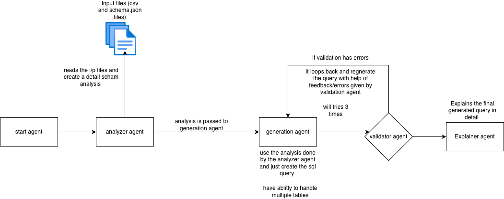

# AI Data Migration Orchestrator
A multi agent orchestration for generating and validating sql migration script 
it can handle multiple tables in the database 
## Quick Start

### 1. Install Dependencies

```bash
uv sync
```
or 
```bash
pip install -e .
```

### 2. Configure API Key
create config.yaml file add the open ai key there in bellow format 
```yaml
openai:
  api_key: (your api key here)
```


### 3. Run

```bash
start_agent
```

## Input Files

Place these files in `data/` directory:

- `source_schema.json` - Source database schema
- `target_schema.json` - Target database schema
- `field_mapping.csv` - Field mappings

### schema for source_schema.json
make sure to use this scema only for the source and target tables 
```json
{
  "table_name": "raisers_edge_donors",
  "fields": [
    {"name": "donor_fname", "type": "VARCHAR(100)", "nullable": false},
    {"name": "donor_lname", "type": "VARCHAR(100)", "nullable": false}
  ]
}
```

### Example: field_mapping.csv

```csv
source_table,source_field,target_table,target_field,transformation
raisers_edge_donors,donor_fname,salesforce_contact,full_name,concat
raisers_edge_donors,donor_lname,salesforce_contact,full_name,concat
raisers_edge_donors,donor_email,salesforce_contact,email,direct
```

## Output Files

Generated in `outputs/` directory:

- `sample_output.sql` - SQL migration script
- `validation_report.md` - Validation results
- `sql_explanation.md` - Human-readable explanation

## Architecture



1. **Schema Analyst** - Analyzes schemas, detects mismatches
2. **SQL Generator** - Generates SQL using LLM
3. **Validator** - Validates SQL against constraints
4. **Explainer** - Generates human-readable explanation

## Requirements

- Python 3.11+
- OpenAI API key
- Dependencies: LangChain, LangGraph, OpenAI

## Project Structure

```
ai-agentic-migration/
├── src/migration_agent/
│   ├── agents/          # 4 agent implementations
│   ├── main.py          # Workflow orchestration
│   └── models.py        # Pydantic models
├── data/                # Input schemas and mappings
├── outputs/             # Generated SQL and reports
└── config.yaml          # Configuration
```

## Configuration

Edit `config.yaml`:

```yaml
openai:
  api_key: ${OPENAI_API_KEY}
```

